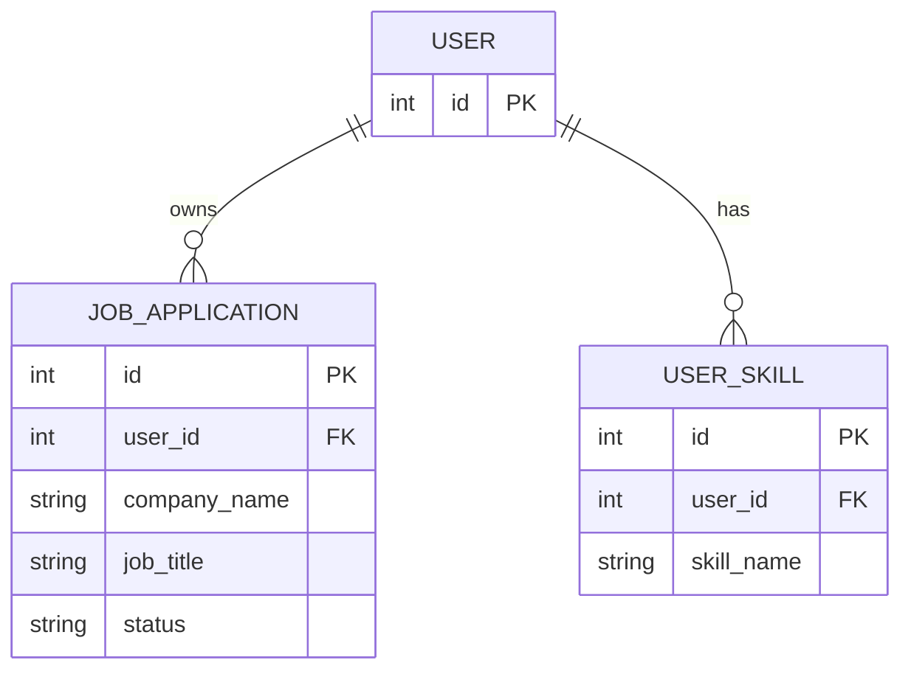

# CareerPilot — ER Diagram

This diagram shows the initial database entities and their relationships.

```mermaid
erDiagram
    USER ||--o{ JOB_APPLICATION : owns
    USER ||--o{ USER_SKILL : has

    USER {
        int id PK
    }

    JOB_APPLICATION {
        int id PK
        int user_id FK
        string company_name
        string job_title
        string status
    }

    USER_SKILL {
        int id PK
        int user_id FK
        string skill_name
    }
```
